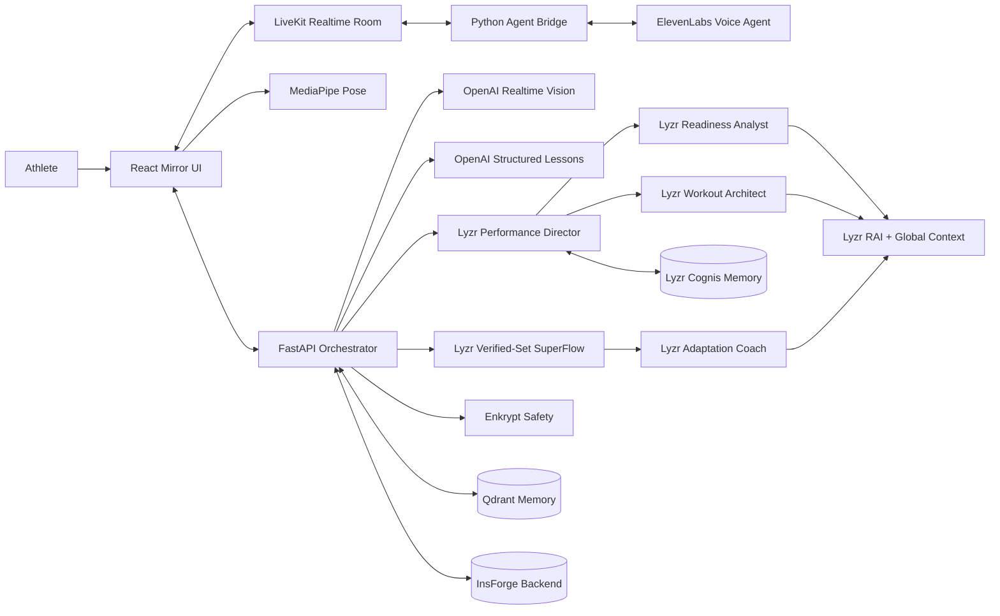

# GameDay Mirror

**An AI-powered daily readiness mirror that can see, listen, remember, and coach.**

GameDay Mirror turns a laptop or phone camera into a personal pre-training station. An athlete has a short voice conversation, sees readiness signals update in real time, performs a movement check, and leaves with a practical plan for the day.

This is not a chatbot placed over a video feed. It is a multimodal coaching workflow that combines live audio, computer vision, memory, structured data, and agent-generated recommendations.

**Live demo:** [i87d4gcb.insforge.site](https://i87d4gcb.insforge.site)

## The Problem

Most athletes train without daily access to a coach. Even when a coach is available, important context is scattered across messages, wearable dashboards, training logs, and memory. A generic recovery score also cannot explain *why* an athlete feels different or show whether movement quality has changed.

This creates three problems:

1. Athletes make training decisions without considering sleep, soreness, nutrition, stress, and recent history together.
2. Coaches cannot perform a personal check-in with every athlete every day.
3. Existing fitness apps collect data but rarely turn it into an immediate, conversational action plan.

GameDay Mirror compresses that workflow into a guided two-minute interaction available anywhere with a camera and microphone.

## What the App Does

1. **Starts a live mirror session.** The athlete joins a LiveKit room with camera and microphone access.
2. **Conducts a voice check-in.** An ElevenLabs voice agent asks concise questions about sleep, training load, fuel, mindset, and spending habits.
3. **Builds structured readiness context.** Answers update recovery, training, fuel, and mindset cards instead of remaining as unstructured chat.
4. **Recalls previous sessions.** Qdrant can retrieve relevant athlete memories so the coach responds with continuity.
5. **Teaches any exercise visually.** The athlete says “teach me a reverse lunge,” Nova calls `teach_exercise`, and OpenAI generates a typed lesson rendered as a safe animated HTML/SVG movement card with steps, cues, mistakes, tempo, and safety guidance.
6. **Runs camera-guided practice.** The athlete asks to practice a squat, push-up, lunge, plank, or glute bridge; Nova calls `start_exercise`, and MediaPipe returns verified progress and form context through LiveKit.
7. **Creates and adapts the workout.** Lyzr combines readiness, Qdrant memory, and verified movement results to build the Core-5 workout and decide the safest next-set adjustment.
8. **Validates and stores the result.** Enkrypt AI can screen generated output, while InsForge persists profiles, answers, metrics, plans, and movement analyses.

When optional services are unavailable, deterministic fallbacks keep the demo functional instead of breaking the experience.

## Who Can Use It?

### Individual Athletes

Use GameDay Mirror before training to decide whether to push, maintain, or recover. It gives athletes a repeatable routine and explains recommendations in plain language.

### Coaches and Trainers

Run consistent remote or in-person check-ins without manually asking and recording the same questions. The structured backend can support future team dashboards, alerts, and longitudinal reports.

### Teams, Academies, and Gyms

Deploy a branded station in a training facility, locker room, or athlete portal. Organizations can change the profile, questions, scoring rules, voice, and movement without rebuilding the realtime infrastructure.

### Developers Building Other Sports Products

The same architecture can support football warm-up checks, basketball landing mechanics, running form, tennis preparation, strength coaching, physical education, esports wellness, or Formula 1 driver readiness. Replace the movement metric logic and agent prompt while retaining LiveKit, persistence, memory, and event contracts.

## Why It Is More Than a Chatbot

| Capability | What happens |
| --- | --- |
| Live presence | Camera, microphone, agent audio, and UI events share one LiveKit session. |
| Visual understanding | Browser pose tracking measures movement; the model receives both an image and numeric biomechanics. |
| Structured actions | Voice answers become typed events, readiness values, database records, and plan inputs. |
| Persistent memory | Previous sessions can influence the next conversation through semantic retrieval. |
| Agent orchestration | Separate voice, analysis, planning, safety, and persistence responsibilities form one workflow. |
| Graceful fallback | The product remains demonstrable when a sponsor API is missing or temporarily unavailable. |

## Agents and Tools Used

### AI Agents

| Agent | Technology | Responsibility |
| --- | --- | --- |
| **Voice Check-in Agent** | ElevenLabs Conversational AI | Runs the check-in, chooses `teach_exercise` or `start_exercise`, and speaks from trusted UI and sensor updates. |
| **Realtime Session Bridge** | LiveKit Agents SDK + Python | Carries audio plus AG-UI tool/state events, validates browser acknowledgements, and forwards accepted lesson or pose status to ElevenLabs. |
| **Generative Lesson Agent** | OpenAI Responses API (`gpt-5.6-terra`) | Produces a strict exercise lesson schema that the UI turns into an animated movement playbook. |
| **Movement Analysis Agent** | OpenAI Realtime (`gpt-realtime-2.1-mini`) | Reviews the camera frame and pose measurements, then returns a score and actionable form cues. |
| **Performance Director** | Lyzr Manager Agent | Dynamically routes readiness and workout requests to managed specialists. |
| **Readiness Analyst** | Lyzr + Cognis memory | Converts six readiness signals and recalled athlete context into three actions for today. |
| **Workout Architect** | Lyzr + Cognis memory | Programs a recovery-aware Core-5 session that the camera can verify. |
| **Movement Adaptation Coach** | Lyzr SuperFlow + Cognis | Uses pose results and prior sets in a deterministic verified-set workflow. |
| **Safety Validator** | Enkrypt AI | Provides a guardrail layer for unsafe, unsupported, or hallucinated recommendations. |

### Platform and Data Tools

| Tool | Use in GameDay Mirror |
| --- | --- |
| **LiveKit** | Realtime room, camera, microphone, agent dispatch, audio, exercise commands, and pose telemetry. |
| **AG-UI protocol** | Correlated tool lifecycles and revisioned state snapshots over LiveKit data channels. |
| **MediaPipe Pose** | On-device body-landmark tracking for squats, push-ups, lunges, planks, and glute bridges. |
| **InsForge** | Athlete profiles, check-in sessions, answers, daily plans, and movement-analysis persistence. |
| **Qdrant** | Semantic retrieval across check-ins, workout decisions, and camera-verified movement results. |
| **React + Vite** | Responsive mirror interface and realtime visual feedback. |
| **FastAPI** | Secure token generation, orchestration endpoints, provider calls, and persistence APIs. |

## Hackathon Alignment

GameDay Mirror was built for the [Sports World Cup Hackathon](https://luma.com/ai-pq8b) and directly targets **Track 1: Athlete Performance & Coaching**, which calls for AI products involving training, biomechanics, analytics, and video analysis.

The project demonstrates each featured ecosystem technology in a user-visible workflow:

- **Lyzr:** supplies a Manager Agent, three managed specialists, Cognis cross-session memory, Global Context, native RAI guardrails, strict JSON schemas, and a deterministic SuperFlow for every verified-set adaptation.
- **Qdrant:** gives Lyzr searchable evidence from check-ins and camera-verified movement results instead of treating every session as new.
- **Enkrypt AI:** adds a safety layer for generated sports recommendations.
- **InsForge:** acts as the agent-native backend for profiles, sessions, answers, metrics, plans, and movement results.

It is also positioned for the hackathon's **Best Use of InsForge** category because InsForge is not a decorative integration: it is the system of record connecting the athlete, the realtime session, and future longitudinal coaching features.

### Recommended Demo Story

1. Explain that most athletes cannot access a coach every morning.
2. Start the mirror and let the voice agent recall the athlete by name.
3. Answer the check-in questions and show cards updating live.
4. Perform three squats and show pose landmarks tracking the body.
5. Reveal the AI movement score and one visible form correction.
6. Generate the personalized daily plan and show that the session is stored.
7. Close with the expansion path: one athlete today, a team readiness platform tomorrow.

## Architecture



### Session Flow

```text
Join room -> load athlete context -> voice questions -> structured answers
          -> AG-UI tool call -> acknowledged browser state snapshot
          -> generated visual lesson or auto-start pose tracking
          -> lesson cues or verified rep context
          -> visual analysis -> plan generation
          -> safety validation -> persistence -> final coaching card
```

## Project Structure

```text
apps/web/           React, LiveKit components, and MediaPipe movement coach
apps/api/           FastAPI token, session, answer, and analysis routes
apps/mirror_agent/  LiveKit-to-ElevenLabs audio and event bridge
src/gameday_mirror/ Persistence, sponsor adapters, and visual analysis
migrations/         InsForge/Postgres schema migrations
tests/              API, event, and deterministic fallback tests
spec/               Product, technical, and hackathon demo specifications
```

## Run Locally

### Prerequisites

- Node.js 20+
- Python 3.11+
- [uv](https://docs.astral.sh/uv/)

### Installation

```bash
git clone https://github.com/pramodthe/gameday.git
cd gameday
cp .env.example .env
npm install
uv sync --extra dev
npm run dev
```

Open [http://localhost:3000](http://localhost:3000). FastAPI runs at [http://127.0.0.1:8001](http://127.0.0.1:8001), with health status at `/api/health`.

Allow camera access to use the mirror and movement coach. The default demo works without provider credentials by using local scenarios and pose-based fallback analysis.

## Configure Live Integrations

Add only the providers you want to enable to `.env`:

| Feature | Required variables |
| --- | --- |
| Live rooms | `LIVEKIT_URL`, `LIVEKIT_API_KEY`, `LIVEKIT_API_SECRET` |
| Voice coach | `ELEVENLABS_API_KEY`, `ELEVENLABS_AGENT_ID` |
| Visual lessons and analysis | `OPENAI_API_KEY`; optional `OPENAI_LESSON_MODEL` and `OPENAI_REALTIME_MODEL` |
| InsForge REST | `INSFORGE_URL`, `INSFORGE_API_KEY`, `INSFORGE_PROFILE_ID` |
| Direct Postgres | `INSFORGE_DATABASE_URL`, `INSFORGE_PROFILE_ID` |
| Semantic memory | `QDRANT_URL`, `QDRANT_API_KEY` |
| Lyzr agent team | `LYZR_API_KEY`, manager and specialist IDs, `LYZR_CONTEXT_ID`, `LYZR_RAI_POLICY_ID`, `LYZR_SUPERFLOW_ID` |
| Safety validation | `ENKRYPTAI_API_KEY` |

Never expose provider secrets through `VITE_*` variables or commit `.env`.

Create or update the four Lyzr dashboard agents. This configures managed-agent links, Cognis cross-session memory, Global Context, RAI policy enforcement, and strict Pydantic-derived output schemas:

```bash
.venv/bin/python scripts/configure_lyzr_agents.py
.venv/bin/python scripts/configure_lyzr_superflow.py
```

The Performance Director handles dynamic conversational routing. The saved **GameDay Verified-Set Adaptation** SuperFlow handles the deterministic post-set path through Lyzr's DAG runner and returns a task ID recorded in application telemetry. `LYZR_REFLECTION_ENABLED=true` enables slower SRS reflection for readiness plans only; keep it disabled during the live demo.

An optional custom OpenAPI connection can read recent InsForge sessions and movement scores. Deploy and register it with:

```bash
npx @insforge/cli functions deploy gameday-agent-context \
  --file functions/gameday-agent-context.ts
.venv/bin/python scripts/configure_lyzr_tools.py
```

The tool is provisioned separately from runtime prompts. Enable `LYZR_CONTEXT_TOOL_ENABLED=true` only after its Lyzr executor smoke test passes, then rerun `configure_lyzr_agents.py`. The production path already supplies scoped Qdrant evidence and remains safe if any tool call fails.

### Start the Voice Worker

After configuring LiveKit and ElevenLabs, start the agent in a second terminal:

```bash
npm run dev:agent
```

The bridge supplies `athlete_name`, `recent_memory`, and `session_id` to the ElevenLabs agent as dynamic variables.

Exercise UI synchronization uses an [AG-UI](https://docs.ag-ui.com/) compatible event subset over LiveKit. The bridge emits `TOOL_CALL_START`, `TOOL_CALL_ARGS`, `TOOL_CALL_END`, and monotonic `STATE_SNAPSHOT` events. The browser replies with `CUSTOM` telemetry carrying the same tool-call ID; stale IDs are ignored, and ElevenLabs receives a tool result only after the browser acknowledges the requested UI.

Register both exercise client tools and their routing rules on the configured ElevenLabs agent:

```bash
.venv/bin/python scripts/configure_elevenlabs_agent.py
```

### Configure InsForge

Link the project using the InsForge CLI, then apply the files in `migrations/` in timestamp order. The database contains athlete profiles, check-in sessions, answers, daily metrics, daily plans, streaks, and movement analyses.

## Development Commands

```bash
npm run dev        # Start the web and API servers
npm run dev:web    # Start only Vite on port 3000
npm run dev:api    # Start only FastAPI on port 8001
npm run dev:agent  # Start the LiveKit/ElevenLabs worker
npm run lint       # Type-check the React application
npm run build      # Build the production web bundle
npm test           # Run the Python test suite
```

## InsForge Deployment

The production app uses three InsForge-managed deployments:

- `apps/web/` is hosted as the public Vite application through InsForge Deployments.
- `gameday-mirror-api` runs the FastAPI orchestrator on InsForge Compute.
- `gameday-mirror-agent` runs the LiveKit/ElevenLabs worker on InsForge Compute.

The root `Dockerfile` selects the API or worker process through `SERVICE_ROLE`. Frontend hosting reads `VITE_API_BASE_URL` from persistent InsForge deployment variables. Compute credentials remain encrypted server-side and are never bundled into the web application.

```bash
# Deploy the frontend after setting its public API URL
npx @insforge/cli deployments env set VITE_API_BASE_URL https://your-api.example.com
npx @insforge/cli deployments deploy apps/web

# Inspect production resources
npx @insforge/cli deployments list
npx @insforge/cli compute list
```

## Current Scope and Safety

The current MVP supports a six-dimension adaptive check-in, generated visual lessons for named exercises, and camera analysis for the Core-5 movement library. It is a sports coaching aid, not a medical device. It must not diagnose injuries, prescribe treatment, or replace a qualified coach or clinician.

MediaPipe landmark tracking runs in the browser. Visual analysis sends one selected camera frame and derived movement measurements to the configured OpenAI model. Production deployments should add user consent, retention controls, authentication, and organization-specific access policies.

## Documentation

- `spec/product-spec.md` — product goals, experience, and requirements
- `spec/technical-spec.md` — architecture, event contracts, and data model
- `spec/demo-script.md` — recommended hackathon presentation flow

## License

No license has been specified. Add one before distributing the project or accepting external contributions.
