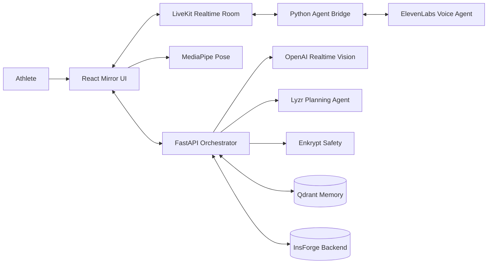

# GameDay Mirror

**An AI-powered daily readiness mirror that can see, listen, remember, and coach.**

GameDay Mirror turns a laptop or phone camera into a personal pre-training station. An athlete has a short voice conversation, sees readiness signals update in real time, performs a movement check, and leaves with a practical plan for the day.

This is not a chatbot placed over a video feed. It is a multimodal coaching workflow that combines live audio, computer vision, memory, structured data, and agent-generated recommendations.

## The Problem

Most athletes train without daily access to a coach. Even when a coach is available, important context is scattered across messages, wearable dashboards, training logs, and memory. A generic recovery score also cannot explain *why* an athlete feels different or show whether movement quality has changed.

This creates three problems:

1. Athletes make training decisions without considering sleep, soreness, nutrition, stress, and recent history together.
2. Coaches cannot perform a personal check-in with every athlete every day.
3. Existing fitness apps collect data but rarely turn it into an immediate, conversational action plan.

GameDay Mirror compresses that workflow into a guided two-minute interaction available anywhere with a camera and microphone.

## What the App Does

1. **Starts a live mirror session.** The athlete joins a LiveKit room with camera and microphone access.
2. **Conducts a voice check-in.** An ElevenLabs voice agent asks concise questions about sleep, training load, fuel, mindset, and spending habits.
3. **Builds structured readiness context.** Answers update recovery, training, fuel, and mindset cards instead of remaining as unstructured chat.
4. **Recalls previous sessions.** Qdrant can retrieve relevant athlete memories so the coach responds with continuity.
5. **Analyzes movement.** MediaPipe tracks pose landmarks locally while the athlete performs squats. OpenAI Realtime reviews a selected frame together with measured depth, symmetry, and torso control.
6. **Creates a daily plan.** The Lyzr planning agent combines the athlete's answers, history, and movement result into concise recommendations.
7. **Validates and stores the result.** Enkrypt AI can screen generated output, while InsForge persists profiles, answers, metrics, plans, and movement analyses.

When optional services are unavailable, deterministic fallbacks keep the demo functional instead of breaking the experience.

## Who Can Use It?

### Individual Athletes

Use GameDay Mirror before training to decide whether to push, maintain, or recover. It gives athletes a repeatable routine and explains recommendations in plain language.

### Coaches and Trainers

Run consistent remote or in-person check-ins without manually asking and recording the same questions. The structured backend can support future team dashboards, alerts, and longitudinal reports.

### Teams, Academies, and Gyms

Deploy a branded station in a training facility, locker room, or athlete portal. Organizations can change the profile, questions, scoring rules, voice, and movement without rebuilding the realtime infrastructure.

### Developers Building Other Sports Products

The same architecture can support football warm-up checks, basketball landing mechanics, running form, tennis preparation, strength coaching, physical education, esports wellness, or Formula 1 driver readiness. Replace the movement metric logic and agent prompt while retaining LiveKit, persistence, memory, and event contracts.

## Why It Is More Than a Chatbot

| Capability | What happens |
| --- | --- |
| Live presence | Camera, microphone, agent audio, and UI events share one LiveKit session. |
| Visual understanding | Browser pose tracking measures movement; the model receives both an image and numeric biomechanics. |
| Structured actions | Voice answers become typed events, readiness values, database records, and plan inputs. |
| Persistent memory | Previous sessions can influence the next conversation through semantic retrieval. |
| Agent orchestration | Separate voice, analysis, planning, safety, and persistence responsibilities form one workflow. |
| Graceful fallback | The product remains demonstrable when a sponsor API is missing or temporarily unavailable. |

## Agents and Tools Used

### AI Agents

| Agent | Technology | Responsibility |
| --- | --- | --- |
| **Voice Check-in Agent** | ElevenLabs Conversational AI | Speaks naturally, asks the daily questions, and produces conversational responses. |
| **Realtime Session Bridge** | LiveKit Agents SDK + Python | Carries athlete audio to ElevenLabs and publishes transcripts and structured events back to the room. |
| **Movement Analysis Agent** | OpenAI Realtime (`gpt-realtime-2.1-mini`) | Reviews the camera frame and pose measurements, then returns a score and actionable form cues. |
| **Daily Planning Agent** | Lyzr | Converts check-in context and memory into a concise training, recovery, fuel, and mindset plan. |
| **Safety Validator** | Enkrypt AI | Provides a guardrail layer for unsafe, unsupported, or hallucinated recommendations. |

### Platform and Data Tools

| Tool | Use in GameDay Mirror |
| --- | --- |
| **LiveKit** | Realtime room, camera, microphone, agent dispatch, audio, and data events. |
| **MediaPipe Pose** | On-device body-landmark tracking and squat biomechanics. |
| **InsForge** | Athlete profiles, check-in sessions, answers, daily plans, and movement-analysis persistence. |
| **Qdrant** | Semantic memory retrieval across previous athlete check-ins. |
| **React + Vite** | Responsive mirror interface and realtime visual feedback. |
| **FastAPI** | Secure token generation, orchestration endpoints, provider calls, and persistence APIs. |

## Hackathon Alignment

GameDay Mirror was built for the [Sports World Cup Hackathon](https://luma.com/ai-pq8b) and directly targets **Track 1: Athlete Performance & Coaching**, which calls for AI products involving training, biomechanics, analytics, and video analysis.

The project demonstrates each featured ecosystem technology in a user-visible workflow:

- **Lyzr:** powers the planning agent that turns multimodal athlete context into a daily action plan.
- **Qdrant:** gives the agent long-term semantic memory instead of treating every check-in as a new conversation.
- **Enkrypt AI:** adds a safety layer for generated sports recommendations.
- **InsForge:** acts as the agent-native backend for profiles, sessions, answers, metrics, plans, and movement results.

It is also positioned for the hackathon's **Best Use of InsForge** category because InsForge is not a decorative integration: it is the system of record connecting the athlete, the realtime session, and future longitudinal coaching features.

### Recommended Demo Story

1. Explain that most athletes cannot access a coach every morning.
2. Start the mirror and let the voice agent recall the athlete by name.
3. Answer the check-in questions and show cards updating live.
4. Perform three squats and show pose landmarks tracking the body.
5. Reveal the AI movement score and one visible form correction.
6. Generate the personalized daily plan and show that the session is stored.
7. Close with the expansion path: one athlete today, a team readiness platform tomorrow.

## Architecture



### Session Flow

```text
Join room -> load athlete context -> voice questions -> structured answers
          -> pose tracking -> visual analysis -> plan generation
          -> safety validation -> persistence -> final coaching card
```

## Project Structure

```text
apps/web/           React, LiveKit components, and MediaPipe movement coach
apps/api/           FastAPI token, session, answer, and analysis routes
apps/mirror_agent/  LiveKit-to-ElevenLabs audio and event bridge
src/gameday_mirror/ Persistence, sponsor adapters, and visual analysis
migrations/         InsForge/Postgres schema migrations
tests/              API, event, and deterministic fallback tests
spec/               Product, technical, and hackathon demo specifications
```

## Run Locally

### Prerequisites

- Node.js 20+
- Python 3.11+
- [uv](https://docs.astral.sh/uv/)

### Installation

```bash
git clone https://github.com/pramodthe/gameday.git
cd gameday
cp .env.example .env
npm install
uv sync --extra dev
npm run dev
```

Open [http://localhost:3000](http://localhost:3000). FastAPI runs at [http://127.0.0.1:8001](http://127.0.0.1:8001), with health status at `/api/health`.

Allow camera access to use the mirror and movement coach. The default demo works without provider credentials by using local scenarios and pose-based fallback analysis.

## Configure Live Integrations

Add only the providers you want to enable to `.env`:

| Feature | Required variables |
| --- | --- |
| Live rooms | `LIVEKIT_URL`, `LIVEKIT_API_KEY`, `LIVEKIT_API_SECRET` |
| Voice coach | `ELEVENLABS_API_KEY`, `ELEVENLABS_AGENT_ID` |
| Visual analysis | `OPENAI_API_KEY`; optional `OPENAI_REALTIME_MODEL` |
| InsForge REST | `INSFORGE_URL`, `INSFORGE_API_KEY`, `INSFORGE_PROFILE_ID` |
| Direct Postgres | `INSFORGE_DATABASE_URL`, `INSFORGE_PROFILE_ID` |
| Semantic memory | `QDRANT_URL`, `QDRANT_API_KEY` |
| Plan generation | `LYZR_API_KEY`, `LYZR_AGENT_ID` |
| Safety validation | `ENKRYPTAI_API_KEY` |

Never expose provider secrets through `VITE_*` variables or commit `.env`.

### Start the Voice Worker

After configuring LiveKit and ElevenLabs, start the agent in a second terminal:

```bash
npm run dev:agent
```

The bridge supplies `athlete_name`, `recent_memory`, and `session_id` to the ElevenLabs agent as dynamic variables.

### Configure InsForge

Link the project using the InsForge CLI, then apply the files in `migrations/` in timestamp order. The database contains athlete profiles, check-in sessions, answers, daily metrics, daily plans, streaks, and movement analyses.

## Development Commands

```bash
npm run dev        # Start the web and API servers
npm run dev:web    # Start only Vite on port 3000
npm run dev:api    # Start only FastAPI on port 8001
npm run dev:agent  # Start the LiveKit/ElevenLabs worker
npm run lint       # Type-check the React application
npm run build      # Build the production web bundle
npm test           # Run the Python test suite
```

## Current Scope and Safety

The current MVP supports a four-question daily check-in and squat analysis. It is a sports coaching aid, not a medical device. It must not diagnose injuries, prescribe treatment, or replace a qualified coach or clinician.

MediaPipe landmark tracking runs in the browser. Visual analysis sends one selected camera frame and derived movement measurements to the configured OpenAI model. Production deployments should add user consent, retention controls, authentication, and organization-specific access policies.

## Documentation

- `spec/product-spec.md` — product goals, experience, and requirements
- `spec/technical-spec.md` — architecture, event contracts, and data model
- `spec/demo-script.md` — recommended hackathon presentation flow

## License

No license has been specified. Add one before distributing the project or accepting external contributions.
