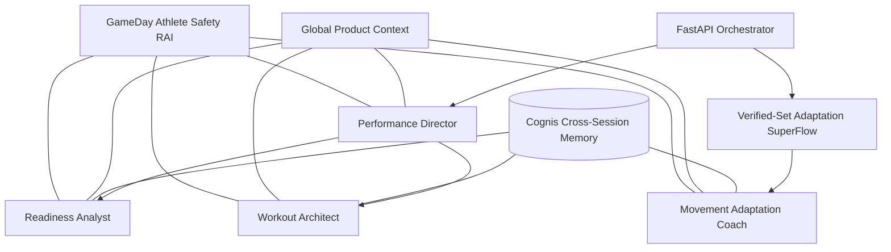

# Lyzr Architecture

## Objective

Lyzr is the product's decision layer, not a decorative API call. GameDay uses both Lyzr orchestration models: a Manager Agent for dynamic routing and SuperFlow for deterministic post-set execution.

## Agent Topology



The manager receives a role-scoped routing request and selects one of three managed agents. Readiness and workout requests then run through the selected specialist. Camera-verified sets use the saved SuperFlow, which guarantees the adaptation node and exposes a task ID for traceability.

## Memory and Context

- Cognis is enabled with cross-session recall on all four agents.
- Stable user IDs preserve athlete continuity; role-scoped session IDs isolate specialist conversations.
- Qdrant supplies explicit evidence snippets for semantic retrieval and visible citations.
- Global Context defines the Core-5 camera boundary, safety rules, storage restrictions, and JSON-only application contract.

## Guardrails and Schemas

The `GameDay Athlete Safety` RAI policy checks toxicity, prompt injection, secrets, and sensitive PII. Credit-card and SSN values are blocked; email and phone values are redacted. Every agent also receives a strict JSON schema generated from the same Pydantic models used by FastAPI. Enkrypt and deterministic rules remain a second output-validation layer.

## Provisioning and Operations

Run the scripts in this order:

```bash
.venv/bin/python scripts/configure_lyzr_agents.py
.venv/bin/python scripts/configure_lyzr_superflow.py
.venv/bin/python scripts/configure_lyzr_tools.py
```

`GET /api/mirror/config` reports enabled Lyzr capabilities without exposing credentials. Workout and adaptation responses include provider, role, specialist session, Manager route or SuperFlow task ID, and execution status. All Lyzr failures degrade to existing structured or deterministic fallbacks.

The InsForge OpenAPI context tool is provisioned but disabled on production agents by default. Set `LYZR_CONTEXT_TOOL_ENABLED=true` only after a successful executor smoke test, then rerun the agent configurator.
