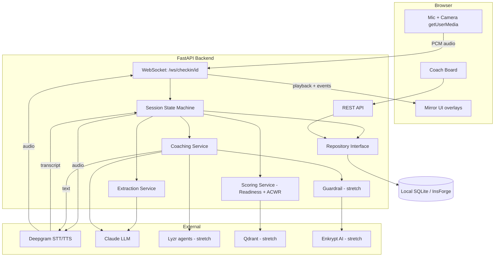

# Design Document

## Overview

ReadyRoom is a two-surface application:

- **Mirror (athlete)** — a browser SPA that shows the webcam feed with glassmorphic overlays, captures microphone audio, and streams it to the backend over a WebSocket. It renders live metric updates, the readiness result, and plays back the coach's spoken message.
- **Coach board** — a browser view that reads aggregated roster readiness from the backend.

The **FastAPI backend** is the orchestrator. It owns the check-in state machine, brokers Deepgram STT/TTS, runs LLM structured extraction and coaching generation, computes the Readiness Score and ACWR, applies guardrails, and persists everything through a repository interface. Keeping keys and logic server-side keeps the frontend thin and makes the scoring deterministic and testable.

Design priorities, in order: **(1) a reliable, high-impact live demo**, **(2) sponsor-tool integration surface** (Deepgram, InsForge, plus optional Lyzr/Qdrant/Enkrypt), **(3) credible sports-science logic** (Readiness + ACWR).

## Architecture



### Component responsibilities

| Component | Responsibility |
|---|---|
| **Session State Machine** | Drives the fixed question sequence, tracks `state` (`CONNECTING/LIVE/LISTENING/SAVING/COMPLETE`) and current question index, coordinates STT → extraction → UI events → next question. |
| **Deepgram Client** | Streaming STT (audio in → interim/final transcripts) and TTS (text → audio). Server-side, one connection per active session. |
| **Extraction Service** | Turns one answer transcript into a typed value via an LLM call constrained to a per-question JSON schema. Normalizes fuzzy quantities; marks missing fields `unknown`. |
| **Scoring Service** | Pure, deterministic functions: `readiness(components) -> 0..100` and `acwr(load_history) -> ratio + flags`. No I/O, fully unit-testable. |
| **Coaching Service** | Maps (readiness band, ACWR flags) → `PUSH/MAINTAIN/RECOVER` via rules, then generates a one-line spoken message (LLM), optionally via Lyzr multi-agent, screened by the guardrail. |
| **Repository** | Abstract persistence for athletes, check-ins, workload history, streaks. Local and InsForge implementations. |
| **REST API** | Read endpoints for readiness/history/streak and the coach board; session bootstrap. |

## Voice check-in sequence

```mermaid
sequenceDiagram
  participant A as Athlete (browser)
  participant W as FastAPI WS
  participant D as Deepgram
  participant L as LLM
  participant R as Repository

  A->>W: open /ws/checkin/{id}
  W-->>A: state=LIVE, ask Q1 (sleep)
  W->>D: TTS(question)
  D-->>A: question audio
  A->>W: stream mic audio
  W->>D: STT stream
  D-->>W: final transcript
  W->>L: extract(schema=sleep, transcript)
  L-->>W: {sleep_hours: 5}
  W-->>A: event: metric.update {sleep_hours:5, state:caution}
  W-->>A: ask Q2 ... (repeat for load, soreness, fuel, mood)
  W->>W: readiness = score(components); acwr = acwr(history)
  W->>L: coaching(readiness, acwr, flags)
  L-->>W: "Readiness 48, recover: load spike + poor sleep"
  W->>D: TTS(coaching)
  D-->>A: coaching audio + text
  W->>R: persist check-in, workload, streak
  W-->>A: state=COMPLETE {readiness, recommendation, streak}
```

## Data models

Pydantic models are the source of truth; the local store persists them as JSON/SQLite rows, the InsForge adapter maps them to collections.

```python
class Athlete(BaseModel):
    id: str
    name: str
    sport: str
    coach_id: str | None = None
    baseline_daily_load: float          # seed for provisional ACWR
    created_at: datetime

class TrainingLoad(BaseModel):
    session_rpe: int | None             # 1..10
    duration_min: int | None
    load: float | None                  # session_rpe * duration_min

class Soreness(BaseModel):
    areas: list[str] = []               # e.g. ["right_hamstring"]

class Nutrition(BaseModel):
    fueled: bool | None
    notes: str | None = None

class CheckInMetrics(BaseModel):
    sleep_hours: float | None
    training: TrainingLoad
    soreness: Soreness
    nutrition: Nutrition
    mood: int | None                    # 1..5
    unknown_fields: list[str] = []

class ReadinessResult(BaseModel):
    score: int                          # 0..100
    band: Literal["LOW","MODERATE","HIGH"]
    components: dict[str, float]        # per-input contribution
    acwr: float | None
    acwr_provisional: bool
    flags: list[str] = []               # HIGH_INJURY_RISK, UNDERTRAINING
    recommendation: Literal["PUSH","MAINTAIN","RECOVER"]

class CheckIn(BaseModel):
    id: str
    athlete_id: str
    date: date
    metrics: CheckInMetrics
    result: ReadinessResult
    coaching_text: str
    transcript: list[dict]              # [{q, answer}]
    created_at: datetime

class Streak(BaseModel):
    athlete_id: str
    current: int
    last_check_in_date: date | None
```

### Scoring formulas (documented + deterministic)

**Readiness** — weighted sum of normalized 0–100 sub-scores; weights tunable in config:

```
readiness = round(
    0.30 * sleep_sub      # 8h+ =100, 7=90, 6=70, 5=50, 4=35, <4=20
  + 0.25 * fatigue_sub    # from soreness count + mood
  + 0.20 * soreness_sub   # 100 if no flags, -25 per flagged area (min 0)
  + 0.15 * nutrition_sub  # fueled=100, skipped=40, unknown=70
  + 0.10 * mood_sub       # mood(1..5) -> 20..100
)
bands: LOW 0-49, MODERATE 50-74, HIGH 75-100
```

Missing inputs are dropped and the remaining weights renormalized; dropped inputs are recorded in `unknown_fields`.

**ACWR:**
```
acute   = mean(daily_load[-7:])
chronic = mean(daily_load[-28:])   # seeded with baseline_daily_load when < 28 days
acwr    = acute / chronic
flags: acwr > 1.5 -> HIGH_INJURY_RISK ; acwr < 0.8 -> UNDERTRAINING
provisional when < 7 real days of history
```

**Recommendation rules:**
```
RECOVER  if band == LOW or HIGH_INJURY_RISK in flags
PUSH     if band == HIGH and 0.8 <= acwr <= 1.3
MAINTAIN otherwise
```

## API contracts

### REST
| Method | Path | Purpose |
|---|---|---|
| `POST` | `/api/sessions` | Create a check-in session for an athlete; returns `session_id`. |
| `GET` | `/api/athletes/{id}/readiness` | Latest `ReadinessResult` + recommendation. |
| `GET` | `/api/athletes/{id}/history?days=28` | Check-in history + workload series. |
| `GET` | `/api/athletes/{id}/streak` | Current streak. |
| `GET` | `/api/coach/{coach_id}/board` | Roster with latest readiness, band, recommendation, flags, `checked_in_today`. |
| `POST` | `/api/athletes` | Create athlete (+ seed baseline). |

### WebSocket `/ws/checkin/{session_id}`
Bidirectional JSON control + binary audio frames.

**Client → server**
- binary frame: raw PCM/Opus audio chunk for the active question
- `{"type":"answer_done"}` — athlete finished speaking the current question
- `{"type":"text_answer","text":"..."}` — fallback when STT is unavailable
- `{"type":"demo_mode","enabled":true}`

**Server → client**
- `{"type":"state","value":"LIVE|LISTENING|SAVING|COMPLETE"}`
- `{"type":"question","index":1,"total":5,"text":"...","audio_url":"..."}`
- `{"type":"transcript","final":true,"text":"..."}`
- `{"type":"metric.update","field":"sleep_hours","value":5,"status":"ok|caution|risk"}`
- `{"type":"coach.log","text":"3 hours of sleep logged."}`
- `{"type":"result","readiness":48,"band":"LOW","recommendation":"RECOVER","acwr":1.6,"flags":["HIGH_INJURY_RISK"],"coaching_audio_url":"...","coaching_text":"..."}`
- `{"type":"error","code":"STT_FAILED","recoverable":true}`

## Backend module layout

```
backend/
  app/
    main.py                 # FastAPI app, CORS, router mounts
    config.py               # settings, feature flags, scoring weights
    ws/checkin.py           # WebSocket endpoint + session loop
    session/state.py        # SessionStateMachine, question script
    services/
      deepgram_client.py    # STT stream + TTS
      extraction.py         # per-question LLM structured extraction
      scoring.py            # readiness() + acwr()  (pure)
      coaching.py           # recommendation rules + message gen
      guardrail.py          # Enkrypt screen (stretch, no-op fallback)
    repositories/
      base.py               # Repository protocol
      local.py              # SQLite/in-memory default
      insforge.py           # InsForge adapter
    api/
      athletes.py
      coach.py
      sessions.py
    models.py               # pydantic models above
    schemas/                # per-question extraction JSON schemas
  tests/
    test_scoring.py
    test_acwr.py
    test_extraction.py
    test_state_machine.py
```

## Question script

| # | Field | Coach prompt | Extraction target |
|---|---|---|---|
| 1 | sleep | "How did you sleep — hours and quality?" | `sleep_hours`, quality note |
| 2 | load | "What did you train yesterday, and how hard, 1 to 10?" | `session_rpe`, `duration_min` |
| 3 | soreness | "Anything sore or tight today?" | `soreness.areas[]` |
| 4 | fuel | "Have you fueled — did you eat this morning?" | `nutrition.fueled`, notes |
| 5 | mood | "How are you feeling, one to five?" | `mood` |

## Error handling

| Failure | Handling |
|---|---|
| Mic permission denied | Fall back to Demo Mode; show explanatory banner (Req 1.5). |
| Deepgram STT drops | Retry once; then accept `text_answer` fallback for that question (Req 3.4). |
| Extraction returns invalid/empty | Re-ask the question once; then record field as `unknown` (Req 2.5, 4.4). |
| LLM/coaching failure | Fall back to a deterministic rule-based coaching sentence (no LLM). |
| Guardrail flags message | Replace with safe generic recovery message (Req 12.2). |
| Persistence failure | Emit `SAVING` failure; keep check-in in memory; expose retry (Req 11.3). |
| < 7 days history | ACWR marked `provisional` using seeded baseline (Req 7.3). |

## Testing strategy

- **Unit (priority):** `scoring.py` and `acwr()` with table-driven cases (known inputs → expected score/band/flags/recommendation). These are the credibility core and must be deterministic.
- **Contract:** extraction schemas validated against sample transcripts ("about five" → 5; "skipped breakfast" → `fueled=false`).
- **State machine:** simulate a five-answer session (mocked STT/LLM) asserting the event sequence and `COMPLETE` payload.
- **Demo Mode:** golden-path snapshot that reproduces the on-stage sequence without external calls.
- **Manual/E2E:** run the mirror against a live Deepgram key; rehearse the 90-second script.

## Tech stack

| Concern | Choice |
|---|---|
| Backend | FastAPI + Uvicorn, Pydantic v2 |
| Realtime | Native FastAPI WebSocket |
| Voice | Deepgram STT (streaming) + TTS |
| LLM | Claude (Opus/Sonnet) for extraction + coaching |
| Persistence | SQLite (default) / InsForge adapter |
| Frontend | React + Vite, `getUserMedia`, Web Audio |
| Stretch | Lyzr (multi-agent coaching), Qdrant (baseline recall), Enkrypt AI (guardrail) |

## Configuration (env)

```
DEEPGRAM_API_KEY=
ANTHROPIC_API_KEY=
PERSISTENCE=local|insforge
INSFORGE_API_KEY=
ENABLE_GUARDRAIL=false
ENABLE_LYZR=false
ENABLE_QDRANT=false
READINESS_WEIGHTS={"sleep":0.30,"fatigue":0.25,"soreness":0.20,"nutrition":0.15,"mood":0.10}
```
